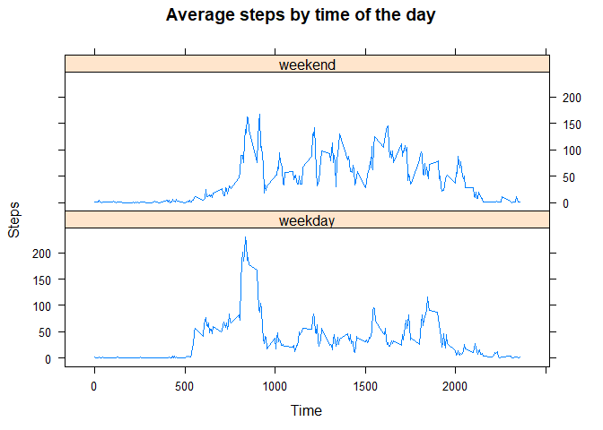

### Loading and Preprocessing the Data
First of all, it is necessary to import the libraries that will be used, those are dplyr, lubridate and lattice. Then, data is loaded and converted to a tibble. Variable daytime is created to get the time intervals in date format.

```r
library(dplyr)
```

```
## 
## Attaching package: 'dplyr'
```

```
## The following objects are masked from 'package:stats':
## 
##     filter, lag
```

```
## The following objects are masked from 'package:base':
## 
##     intersect, setdiff, setequal, union
```

```r
library(lubridate)
```

```
## 
## Attaching package: 'lubridate'
```

```
## The following objects are masked from 'package:base':
## 
##     date, intersect, setdiff, union
```

```r
library(lattice)
data <- read.csv('activity.csv')
data <- tbl_df(data)
```

```
## Warning: `tbl_df()` is deprecated as of dplyr 1.0.0.
## Please use `tibble::as_tibble()` instead.
## This warning is displayed once every 8 hours.
## Call `lifecycle::last_warnings()` to see where this warning was generated.
```

```r
daytime <- '00:00'
daytime <- strptime(daytime, '%H:%M')
for (i in 2:288){
  daytime[i]<-daytime[i-1]+minutes(5)
}
```
### Mean Total Number of Steps Taken per Day
Data is grouped and summarized to get the total steps per day, mean and median. Results are shown in a graph. 

```r
p1 <- data%>%
  group_by(date)%>%
  summarize(sum(steps, na.rm = TRUE))
```

```
## `summarise()` ungrouping output (override with `.groups` argument)
```

```r
hist(p1$`sum(steps, na.rm = TRUE)`, xlab = 'Steps', main = 'Histogram of Steps per day')
```

<!-- -->

```r
mean(p1$`sum(steps, na.rm = TRUE)`)
```

```
## [1] 9354.23
```

```r
median(p1$`sum(steps, na.rm = TRUE)`)
```

```
## [1] 10395
```
The average number of steps taken per day is 9354, and the median is 10395.
### Average Daily Activity Pattern
Data is grouped and summarized to get the mean steps per interval of the day. The daily activity pattern is shown in the graph. Then, data is sorted to get the interval that present the most activity in the day.

```r
p2 <- data%>%
  group_by(interval)%>%
  summarize(mean(steps, na.rm = TRUE))
```

```
## `summarise()` ungrouping output (override with `.groups` argument)
```

```r
plot(daytime, p2$`mean(steps, na.rm = TRUE)`, type ='l', xlab = 'Time', ylab = 'Steps', main = 'Average steps by time of the day')
```

<!-- -->

```r
sorted <- arrange(p2, desc(p2$`mean(steps, na.rm = TRUE)`))
sorted[1,]
```

```
## # A tibble: 1 x 2
##   interval `mean(steps, na.rm = TRUE)`
##      <int>                       <dbl>
## 1      835                        206.
```
The most active interval in the day is at 8:35 am and the mean number of steps during this interval is 206.
### Imputing Missing Values
A new data frame is created to see how the mean and median total number of steps taken per day change when missing values are filled in. Missing values are replaced with the mean of the intervals calculated in the previous part of the project.

```r
df <- data
for(i in 1:dim(df)[1]){
  if(is.na(df$steps[i])){
    df$steps[i] <- p2$`mean(steps, na.rm = TRUE)`[p2$interval==df$interval[i]]
  }
}
p3 <- df%>%
  group_by(date)%>%
  summarize(sum(steps, na.rm = TRUE))
```

```
## `summarise()` ungrouping output (override with `.groups` argument)
```

```r
hist(p3$`sum(steps, na.rm = TRUE)`, xlab = 'Steps', main = 'Histogram of Steps per day')
```

<!-- -->

```r
mean(p3$`sum(steps, na.rm = TRUE)`)
```

```
## [1] 10766.19
```

```r
median(p3$`sum(steps, na.rm = TRUE)`)
```

```
## [1] 10766.19
```
The average number of steps after missing values were replaced is 10766, it increased about 1400 steps compared to the value ignoring missing values. The median is now 10766 also increasing 400 steps compared to the median before replacing missing values.
### Activity Patterns in Weekdays and Weekends
Variable day is created into the data frame to identify if a day is a weekday or weekend. Then, a panel graph is made to compare the activity patterns in those days.

```r
weekdays <- c('lunes', 'martes', 'miércoles','jueves','viernes')
weekend <- c('sábado', 'domingo')
df$date <- ymd(df$date)
df$day <- weekdays(df$date)
df$day[df$day %in% weekdays] <- 'weekday'
df$day[df$day %in% weekend] <- 'weekend'
p4 <- df%>%
  group_by(day, interval)%>%
  summarize(mean(steps, na.rm = TRUE))
```

```
## `summarise()` regrouping output by 'day' (override with `.groups` argument)
```

```r
xyplot(`mean(steps, na.rm = TRUE)` ~ interval | day, p4, type = 'l', layout = c(1,2),xlab = 'Time', ylab = 'Steps', main = 'Average steps by time of the day')
```

<!-- -->
